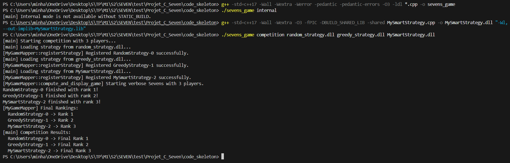

# **SEVEN DEADLY SINS**

#### Participants : Minh Nhut NGUYEN & Manel MOULAHCENE
#### Project developed as part of Advanced C++ Course

## **Project Overview**

This document outlines the implementation of a competitive framework for the Sevens (7,Nana Narabe) card game. We implement here a strategy that competes against those of our classmates to see whose algorithm most effectively wins at the Sevens card game.

## **Implemented strategy and justification**
### **1. Prioritizing the 7s:**

The game of Sevens begins with the 7 cards, as each 7 played unlocks a new suit (Spades, Hearts, Clubs, Diamonds). MySmartStrategy gives top priority to playing 7s when available, because without them, no progression can happen within that suit. Playing a 7 opens up the possibility to play higher and lower cards in that suit. In the implementation, the strategy checks for playable 7s by verifying if a 7 in a given suit has not yet been played (!table[card.suit].count(6)), and prioritizes playing it over other cards.

### **2. Future Optimization:**

When multiple playable cards are available, `MySmartStrategy` selects the one most likely to unlock other cards in the player’s hand. For example, playing a card like 9♣ might allow the player to later play 8♣ or 10♣. This minimizes future blocks and increases the chances of continuing turns without passing. The current implementation achieves this by iterating through playable cards and favoring those that enable other cards in the same suit (e.g., playing a card where the player holds the rank above or below in the same suit). This ensures smoother progression in future turns.

### **3. Strategic Preservation of Central Cards (6 and 8):**

Cards ranked 6 and 8 are central to each suit’s sequence, as they connect the lower ranks (e.g., 5) and higher ranks (e.g., 9). Playing them too early might enable opponents waiting on 5s or 9s. While the current implementation of `MySmartStrategy` does not explicitly delay playing 6s and 8s, it lays the foundation for this tactic by introducing strategic passing (see below). Future improvements will prioritize delaying these central cards to control the game’s pace and avoid giving easy plays to opponents.

### **4. Opponent Behavior Monitoring:**

`MySmartStrategy` includes methods to collect data on opponents’ behaviors:

` observeMove`: Records each played card to eventually reconstruct opponent hands or identify suit progress.
- `observePass`: Tracks each pass to detect weaknesses by suit in other players, which could be used for blocking tactics.

Currently, these methods are implemented as stubs (empty functions) to lay the foundation for advanced adaptive gameplay. Future updates will use this data to make informed decisions, such as targeting suits where opponents are weak or predicting their remaining cards.

### **5. Strategic Retention / Bluffing:**

`MySmartStrategy` introduces controlled bluffing by occasionally not playing a card even when a valid move exists. For example, if the player holds 6♠ and 5♠, playing 6♠ immediately enables the 5♠, but holding onto the 6♠ can force opponents to pass, gaining a tactical edge. The current implementation achieves this with a 50% chance of passing when the player has more than 5 cards, even if a valid move is available. This introduces unpredictability and can disrupt opponents’ strategies, especially in multi-round games where preserving key cards can lead to better scoring.

### **6. Partial Randomization:**

To avoid being too predictable, especially against other AIs or human players, `MySmartStrategy` incorporates partial randomization. When multiple equally viable options exist (e.g., multiple playable 7s or cards with similar strategic value), the strategy selects one at random using a random number generator (`std::mt19937`). This adds behavioral variation, making the strategy harder to counter through pattern recognition. For example, if the strategy identifies multiple playable cards that unlock future moves, it randomly picks one to maintain unpredictability.

## **Sample performance** 

## **Limitations and conclusions**
### ***Limitations:***
1. Passive Opponent reading:

`MySmartStrategy` stores information about opponents' moves and passes through the `observeMove` and `observePass`  methods, but this data is not yet actively used. The strategy does not deduce opponents’ hands or intentionally block their sequences based on this information. Future improvements could leverage this data to target suits where opponents are weak or predict their remaining cards for more effective blocking.

2. No Calculated Risk-Taking:

The strategy currently adopts a cautious approach and does not play aggressively, even in situations where taking risks might force an opponent to pass or disrupt their plan. For example, it does not prioritize playing cards that could block an opponent’s sequence if it risks the player’s own progression. Adding calculated risk-taking could improve the strategy’s competitiveness, especially in multi-round games.

3. Basic Strategic Retention:

While `MySmartStrategy` implements strategic retention by passing with a 50% probability when the player has more than 5 cards (even with a valid move), this bluffing mechanism is not tailored to specific cards like 6s and 8s with their immediate neighbors (5s or 9s). More advanced forms of blocking or strategic delay, such as delaying central cards to control the game’s pace, are not yet implemented but are planned for future improvements.

### ***conclusions:***
This project allowed us to design a card game in C++ with a modular architecture. We developed a smart strategy and tested it against random and greedy strategies.Then we will participate to a competition with other student to compare whose strategy is better. This work strengthened our understanding of object-oriented programming and dynamic loading.

## **Credit/acknowledgement/references** 
- [Sevens Game Rules](project_description/advanced_cpp_project_v2.pdf)
- [Strategy Development](project_description/strategy_development_sevens_game.pdf)

